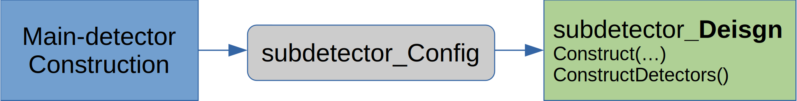

Adding a detector
=================

   The word "detector" is ambiguous. In this text and code we use "subdetector" to reference a single part of an
   experimental setup (E.g. calorimeter, vertex tracking). And "main-detector" to reference the whole experimental setup
   (e.g. JLEIC, BEAST, ePHENIX)

In order to maintain many subdetectors G4E tries to isolate each individual subdetector.
Each subdetector files are located in `src/subdetectors`_ directory.
There is no strict API such (as particular base class) for a subdetector, but there are a number of recommendations.

In order to add subdetecter one has to:
 - Add detector related files to `src/subdetectors`_
 - Add classes <detector-name>_Config and <detector-name>_Design
 - Add subdetector to main-detector DetectorConstruction class

1. Adding detector related files:
~~~~~~~~~~~~~~~~~~~~~~~~~~~~~~~~~

Each subdetector should create a directory in `src/subdetectors`_ with the name according to naming convention.
(Such as ci_EMCAL - stands for Central Ion EMCAL).

- The minimal subdetector stub may just be defined in a single
  header file which then will be included in main-detector construction file.
  Example of a single header stub - `ce_GEM`_ :

- For more complex scenarios - cmake `CMakeFileLists.txt` should be created and the directory added to
  `src/subdetectors/CMakeLists.txt`_. Example of such scenario is `ce_EMCAL`_

Such approach can be extended to connecting the whole libraries to G4E with CMake if needed.

This is a recommendation and if a subdetector needs more global changes to the other G4E parts it can be done
(and discussed later). But the main design goal here is to try have as many as possible subdetector related code
in a special dedicated place, where experts can work on it with minimum interference from the rest of the codebase changes
(and vise versa).

2. <detector-name>_Config and <detector-name>_Design paradigm:
~~~~~~~~~~~~~~~~~~~~~~~~~~~~~~~~~~~~~~~~~~~~~~~~~~~~~~~~~~~~~~

Subdetectors may have pretty complex logic in order to decouple it from the rest of G4E code it is recommended,
that for each of the subdetector one creates <detector-name>_Config and <detector-name>_Design.

- <detector-name>_Config is a flat structure (with Geant4 messenger if needed) with parameters
  that might be changed from global detector construction.

- <detector-name>_Design - a class with at minimum `Construct` and `ConstructDetectors` methods that is called from main-detector
  construction in order co create geometry. This class may have other methods to construct details and manipulate the
  subdetector.

The minimal <detector-name>_Config may look like this:

.. code:: c++

    struct ce_GEM_Config {
        double RIn = 0 * cm;      // Inner diameter
        double ROut = 95 * cm;    // Outer diameter
        double SizeZ = 30 * cm;   // Size in Z direction
        double PosZ =0*cm;        // Absolute Z position (set by DetectorConst.)
        int Nlayers =8;           // Number of layers
    };

It is recommended that <detector-name>_Design class should have:

- method `Construct(<detector-name>_Config, G4VPhysicalVolume *motherVolume)` which constructs detector outer volume
- method `ConstructDetectors()` which constructs inner detector geometry (e.g. GEM layers)
- field  `G4VPhysicalVolume*` which holds a pointer to detector outer volume (creted in Construct method)
- field  `<detector-name>_Config` that holds detector config given to it by Construct method
- optional `ConstructSDandField` method is subdetector requires custom sensitive detector class or uses FieldManager
  (this is required for Geant4 multithreading model and is very well described in official documentation and
  `here <https://twiki.cern.ch/twiki/bin/view/Geant4/QuickMigrationGuideForGeant4V10>`_

.. code:: c++

    /// Geometry construction
    class ce_GEM_Design {
    public:

        /// This function constructs the outer GEM volume
        inline void Construct(ce_GEM_Config cfg, G4Material *outerMaterial, G4VPhysicalVolume *motherVolume) {
            ConstructionConfig = cfg;
            // Create outer volume for GEM detector
            Solid = new G4Tubs("ce_GEM_GVol_Solid", cfg.RIn, cfg.ROut, cfg.SizeZ / 2., 0., 360 * deg);
            Logical = new G4LogicalVolume(Solid, outerMaterial, "ce_GEM_GVol_Logic");
            PhysicalVolume = new G4PVPlacement(0, G4ThreeVector(0, 0, cfg.PosZ), "ce_GEM_GVol_Phys", Logical, motherVolume, false, 0);
        };

        /// This function construct all GEM details
        inline void ConstructDetectors() {
            // ... GEM layers are constructed here
        };

        G4VPhysicalVolume *PhysicalVolume;  // public pointer to the physical
        ce_GEM_Config  ConstructionConfig;  // public Parameters that was used in the moment of construction
                                               (copy constructed)
    private:
        //... all needed private variables
    };

One can see the full example here: `ce_GEM`_

.. _src/subdetectors: https://gitlab.com/eic/escalate/g4e/-/tree/master/src/subdetectors
.. _src/subdetectors/CMakeLists.txt: https://gitlab.com/eic/escalate/g4e/-/blob/master/src/subdetectors/CMakeLists.txt
.. _ce_GEM: https://gitlab.com/eic/escalate/g4e/-/tree/master/src/subdetectors/ce_GEM
.. _ce_EMCAL: https://gitlab.com/eic/escalate/g4e/-/tree/master/src/subdetectors/ce_EMCAL

3. Main-detector construction
~~~~~~~~~~~~~~~~~~~~~~~~~~~~~

Geant4 uses `DetectorConstruction` class in order to create geometry. There are currently 2 detector constructions:

- ReferenceDetectorConstruction - class the builds whole ReferenceDetector
- SingleSubdetectorConstruction - this class can be used to cunstruct and render solo subdetector

DetectorConfig structure holds _Config structures from all subdetectors.

So in order to render subdetector one has to:

1. Add <subdetector-name>_Config to DetectorConfig class. It is recommended to name the field by the subdetector name

   .. code:: c++

      struct DetectorConfig {
      // ...
      ci_GEM_Config ci_GEM

2. Add <subdetector-name>_Design to ReferenceDetectorConstruction to render the subdetector as a part of ReferenceDetector
3. Add <subdetector-name>_Design to SingleSubdetectorConstruction to render the subdetector alone

