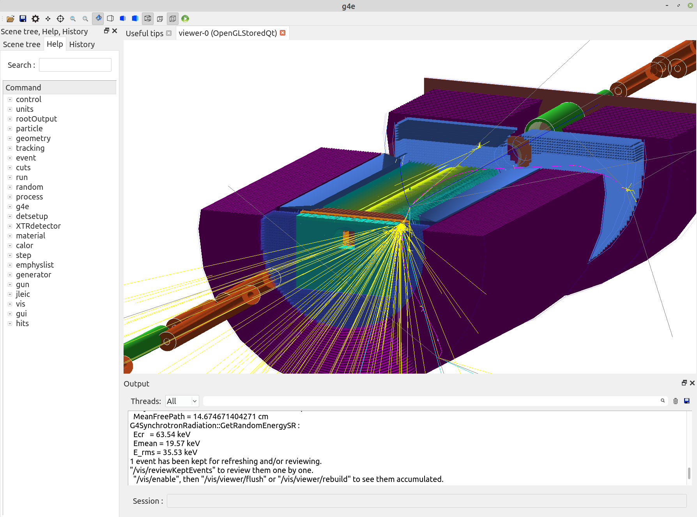

.. Geant 4 EIC documentation master file

Welcome to Geant 4 EIC's documentation!
=======================================

.. toctree::
   :maxdepth: 2
   :caption: Getting Started:

   01_quick_start
   01_install
   01_run
   01_visualization

.. toctree::
   :maxdepth: 2
   :caption: Design:

   generators
   output
   detector_naming
   detector_import
   multithreading
   python_orchestrationl

.. toctree::
   :maxdepth: 2
   :caption: How to:

   g4e_13-14_migration
   howto_process_mc_files

.. toctree::
   :maxdepth: 1
   :caption: Escalate:

   Escalate main docs <https://escalate.readthedocs.io>

.. toctree::
   :maxdepth: 1
   :caption: Links:

   GitHub <https://gitlab.com/eic/escalate/g4e>
   Issues? Help is here <https://gitlab.com/eic/ejpm/issues>

G4E is a lightweight pure Geant4 implementation of full simulation for EIC.

