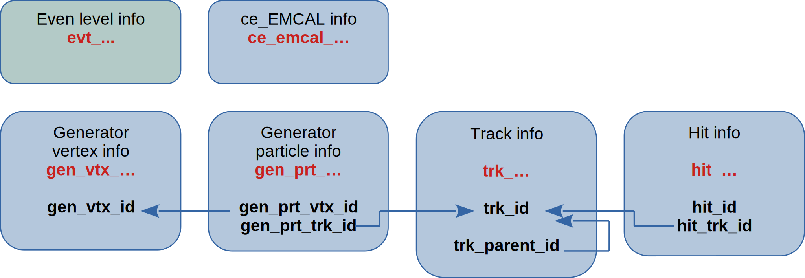

Output
======

G4E output data structure
-------------------------

The g4e output is made out of so called aligned arrays.

Each array holds values of a single entity e.g. **trk_mom** - hold momentums for each track in the event.

Arrays are grouped by name prefixes, e.g  tracks (trk\_...), hits (hit\_...), generator particles (gen_prt\_...), etc.

All arrays with the same name prefix have the same length. e.g. all trk\_... has the same length, the length is
defined in trk_count variable (while can be retrieved with size() method - trk_mom.size())

Arrays reference each other with id. This is close to relational DBs. In recent G4E versions (API v3) there is also *_index
which reference directly an index in an array:

If event hierarchy is described like this:

.. code::

    event 1
        track 1 - electron 10GeV
            hit_11
            hit_12
            hit_13
        track 2 - proton   100GeV
            hit_21
            hit_22

In g4e output will be written like this:

.. code::

    event_id  = 1

    trk_count = 2
    trk_id    = [1,  2]
    trk_pdg   = [11, 2112]
    trk_mom   = [10, 100]
    trk_...   = [...    ]  - all arrays will be of 2 elements

    hit_count     = 5
    hit_...       = [...] - all arrays are of 5 elements
    hit_id        = [1,  2,   3,    4,  5]
    hit_trk_id    = [1,  1,   1,    2,  2] - link to tracks
    hit_trk_index = [0,  0,   0,    1,  1] - index in track array
    hit_z         = [10, 100, 200, -1, -5]

IDs vs Indexes
~~~~~~~~~~~~~~

(Only works with newer G4E)

There are two different fields **hit_trk_id** and **hit_trk_index**:

- hit_trk_id - represents a track id issued by Geant4 (unique inside an event). hit_trk_id-s
   may not correspond to the order of how they are written in trk_... arrays and not all tracks are written

- hit_trk_index - track index in trk_... array. So it is safe to use like this:
    .. code:: c++

       for(int i=0; i < hit_count; i++) {
          // Get parent track momentum
          double momentum = trk_mom[hit_trk_index[i]];
       }

Dimentions
~~~~~~~~~~

All dimentions - mm
All energies and momentums - GeV

Controlling what is written
---------------------------

To control how many generation of secondaries (tracks and their hits) to save, there is a configuration:

`/rootOutput/saveSecondaryLevel <ancestry-level>`

<ancestry-level> sets 0-n levels of ancestry which are saved in root file.

**Example:**

* -1 -  save everything
* 0  - save only primary particles
* 1  - save primaries and their daughters
* 2  - save primaries, daughters and daughters' daughters
* n  - save n generations of secondaries

(primaries - particles that came from a generator/input file)

The default level is 3, which corresponds to:

`/rootOutput/saveSecondaryLevel 3`
